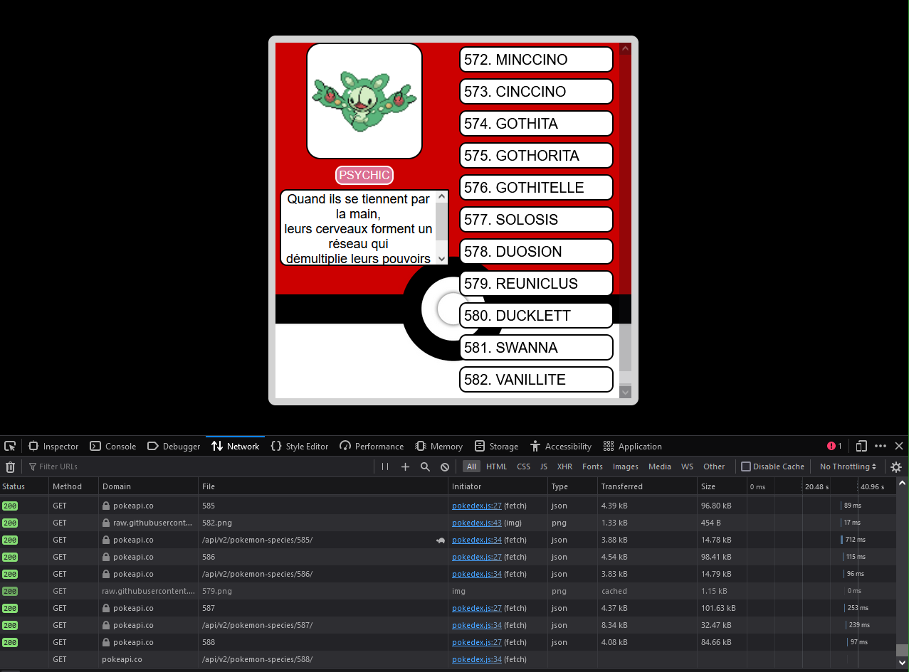

# Project Summary
The PokeDex WebApp is a web application that pulls information from the PokeAPI and displays it in your web browser. It allows users to search for and view information about different Pokémon, such as their abilities, stats, moves, types, and evolution chain.

# File Walk-Throughs
## pokedex.css
This is a CSS (Cascading Style Sheets) code which is used to style HTML documents.

1. `body`: This is a selector that targets the `<body>` element of the HTML document.
    - `font-family: Arial, Helvetica, sans-serif;`: This sets the default font of the body to Arial, if Arial is not available, it will use Helvetica, if Helvetica is not available, it will use any sans-serif font.
    - `background: url(images/pokedex_image.jpg) no-repeat;`: This sets the background image of the body to 'pokedex_image.jpg' which is located in the 'images' folder. The 'no-repeat' value means the image will not repeat itself if it doesn't cover the whole body.
    - `background-size: cover;`: This makes the background image cover the entire body, even if it has to stretch the image or cut a little bit off the edges.

2. `#content-box`: This is an ID selector that targets the HTML element with the id of 'content-box'.
    - The properties inside this selector (like `width`, `height`, `border`, `border-radius`, `display`, `margin`, `background`, `background-size`) are styling that element. For example, it's setting the width and height of the element, giving it a border, making its display type flex (which is used for aligning items in the best possible way), setting its margin, and giving it a background image.

3. `#pokemon-info`, `#pokemon-list`, `.pokemon-name`, `#pokemon-info img`, `#pokemon-types`, `#pokemon-description`, `.type-box`: These are other selectors targeting elements with those specific ids or classes and applying styles to them.

4. `.normal`, `.fire`, `.grass`, `.water`, `.ice`, `.electric`, `.fighting`, `.flying`, `.bug`, `.ghost`, `.rock`, `.ground`, `.steel`, `.dark`, `.psychic`, `.fairy`, `.dragon`, `.poison`: These are class selectors that apply specific styles to elements with these classes. They seem to represent different types of Pokemon and are styled with different colors to represent each type.

IMPORTANT NOTE: in CSS, a `.` before a word means it's a class, and a `#` means it's an ID. Classes can be used multiple times in a document, but IDs should be unique.

## pokedex.html
This is an HTML (HyperText Markup Language) document. HTML is the standard markup language for documents designed to be displayed in a web browser.

1. `<!DOCTYPE html>`: This is the document type declaration and it's used to tell the browser that this is an HTML5 document.

2. `<html>`: This is the root element of an HTML page.

3. `<head>`: This element contains meta-information about the HTML document that isn't displayed on the page. It typically includes the title of the document, character encoding, links to stylesheets, scripts, etc.

4. `<meta charset="UTF-8">`: This specifies the character encoding for the HTML document, which is UTF-8 in this case.

5. `<meta name="viewport" content="width=device-width, initial-scale=1.0">`: This is used for responsive web design. It sets the width of the page to follow the screen-width of the device (which will vary depending on the device), and the initial zoom level when the page is first loaded by the browser.

6. `<title>Pokedex</title>`: This sets the title of the document, which is displayed in the browser's title bar or tab.

7. `<link rel="stylesheet" href="pokedex.css">`: This links an external CSS file (pokedex.css) to the HTML document. The CSS file is used to style the HTML document.

8. ``: This links an external JavaScript file (pokedex.js) to the HTML document. The JavaScript file is used to add interactivity to the HTML document.

9. `<body>`: This contains the content of the HTML document, i.e., everything that is displayed on the page.

10. `
`: This is a division or a section in an HTML document. The id attribute is used to point to a specific style declaration in a stylesheet.

11. `
`: This is another division with an id of 'pokemon-info'. It seems to be used to display information about a Pokemon.

12. ``: This is an image element that displays an image of a Pokemon. The source of the image is specified in the src attribute.

13. `
`: This division seems to be used to display the types of a Pokemon.

14. `GRASSPOISON`: These are span elements used to display the types of a Pokemon. The class attribute is used to point to a specific style declaration in a stylesheet.

15. `

`: This division seems to be used to display a description of a Pokemon.

16. `
`: This division seems to be used to display a list of Pokemon.

IMPORTANT NOTE: in HTML, an id should be unique within a page, while a class can be used to identify multiple elements.

## pokedex.js
This is a JavaScript code that interacts with the PokeAPI to fetch and display information about Pokemon. Let's go through it line by line:

1. `const pokemonCount = 1008;`: This declares a constant `pokemonCount` and assigns it a value of 1008. This is likely the total number of Pokemon that the code will fetch.

2. `var pokedex = {};`: This declares a variable `pokedex` and assigns it an empty object. This object will likely be used to store information about each Pokemon.

3. `window.onload = async function() {...}`: This is an event handler that will be executed once the entire page (including all dependent resources like images and scripts) has finished loading. The function is declared as `async`, which means it returns a Promise and allows the use of `await`.

4. `for (i = 1; i <= pokemonCount; i++) {...}`: This is a for loop that will iterate from 1 to `pokemonCount` (1008). For each iteration, it will execute the code inside the loop.

5. `await getPokemon(i)`: This calls the `getPokemon` function with the current iteration number as an argument. The `await` keyword is used to pause and resume the async function and wait for the promise's resolution or rejection.

6. `let pokemon = document.createElement("div");`: This creates a new div element and assigns it to the variable `pokemon`.

7. `pokemon.id = i;`: This sets the id of the `pokemon` div to the current iteration number.

8. `pokemon.innerText = i.toString() + ". " + pokedex[i]["name"].toUpperCase();`: This sets the inner text of the `pokemon` div to a string that includes the current iteration number and the name of the Pokemon (retrieved from the `pokedex` object and converted to uppercase).

9. `pokemon.classList.add("pokemon-name");`: This adds the class "pokemon-name" to the `pokemon` div.

10. `pokemon.addEventListener("click", updatePokemon);`: This adds a click event listener to the `pokemon` div. When the div is clicked, the `updatePokemon` function will be executed.

11. `document.getElementById("pokemon-list").append(pokemon);`: This appends the `pokemon` div to the element with the id "pokemon-list".

12. `document.getElementById("pokemon-description").innerText = pokedex[1]["desc"];`: This sets the inner text of the element with the id "pokemon-description" to the description of the first Pokemon (retrieved from the `pokedex` object).

13. `console.log(pokedex);`: This logs the `pokedex` object to the console.

14. `async function getPokemon(num) {...}`: This is an async function that fetches information about a Pokemon from the PokeAPI.

15. `function updatePokemon() {...}`: This function updates the displayed Pokemon information when a Pokemon div is clicked. It updates the image source, clears and updates the type information, and updates the description.
